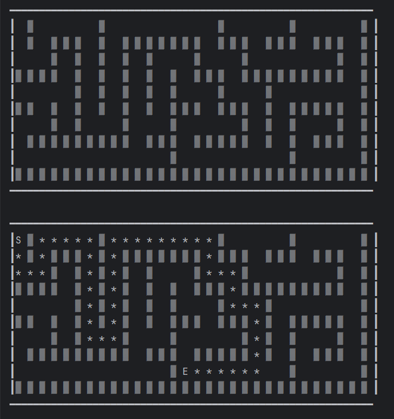

## Алгоритм генерации лабиринта (DFS):

Замечание: предполагается, что изначально у каждой клетки есть стенки со всех четырех сторон, которые отделяют ее от соседних клеток.

1. Сделайте начальную клетку текущей и отметьте ее как посещенную.
2. Пока есть непосещенные клетки
1. Если текущая клетка имеет непосещенных «соседей»
   1. Протолкните текущую клетку в стек
   2. Выберите случайную клетку из соседних
   3. Уберите стенку между текущей клеткой и выбранной
   4. Сделайте выбранную клетку текущей и отметьте ее как посещенную.
2. Иначе если стек не пуст
   1. Выдерните клетку из стека
   2. Сделайте ее текущей
3. Иначе
   1. Выберите случайную непосещенную клетку, сделайте ее текущей и отметьте как посещенную.

## Алгоритм решения лабиринта (DFS || backtracker)

1. Сделайте начальную клетку текущей и отметьте ее как посещенную.
2. Пока не найден выход
1. Если текущая клетка имеет непосещенных «соседей»
   1. Протолкните текущую клетку в стек
   2. Выберите случайную клетку из соседних
   3. Сделайте выбранную клетку текущей и отметьте ее как посещенную.
2. Иначе если стек не пуст
   1. Выдерните клетку из стека
   2. Сделайте ее текущей
3. Иначе выхода нет

## Запуск
Запуск осуществляется из Main.java

## Пример генерации и решения

Лабиринт с высотой 10, шириной 30. Ищется путь из (0, 0) в (8, 14)

